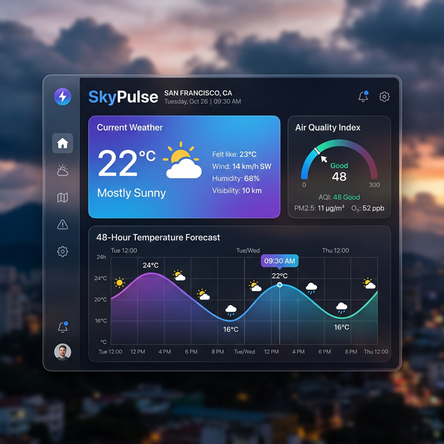

# SkyPulse: Modern Weather & Air Quality Dashboard



**SkyPulse** is a high-performance, aesthetically pleasing weather dashboard designed for modern users. It combines real-time weather tracking, air pollution monitoring (AQI), and 48-hour interactive forecasts in a sleek, glassmorphic interface.

Designed with engineering excellence, it features custom React hooks, robust error handling, and a modular architecture.

---

## Key Features

-    Premium Glassmorphism UI**: A vibrant, responsive interface with dynamic background themes based on weather conditions (Sunny, Rainy, Cloudy, etc.).
-    Air Quality Index (AQI)**: Detailed pollution monitoring including PM2.5, PM10, and health recommendations.
-    Interactive Forecasts**: Visualized temperature trends using **Recharts** with a 48-hour hourly breakdown.
-    Search History**: LocalStorage-integrated "Recent Searches" for quick access to your favorite cities.
-    Skeleton Loading**: Shimmering loading states for a seamless user experience (no more blank flashes).
-    Engineering Best Practices**:
    -   **Custom Hooks**: Clean business logic separation via `useWeather`.
    -   **Error Boundaries**: Graceful failure handling and user recovery.
    -   **Unit Testing**: Core logic verified with **Vitest**.

---

## Tech Stack

-   **Frontend**: React (Vite), Framer Motion, Recharts, Lucide Icons.
-   **Backend**: Python, FastAPI, Uvicorn.
-   **API**: OpenWeatherMap (Weather, Pollution & Forecast APIs).
-   **Testing**: Vitest.

---

## Installation & Setup

### 1. Backend Setup
```bash
cd backend
pip install -r requirements.txt
# Create .env and add your OPENWEATHER_API_KEY
python main.py
```

### 2. Frontend Setup
```bash
cd frontend
npm install
npm run dev
```

### 3. Running Tests
```bash
cd frontend
npm test
```

---

## Interface Preview
*Dynamic backgrounds adjust automatically:*
- **Sunny**: Warm blue-sky gradient.
- **Rainy**: Deep indigo rain-washed theme.
- **Stormy**: Dark purple electrical storm aesthetic.

---


